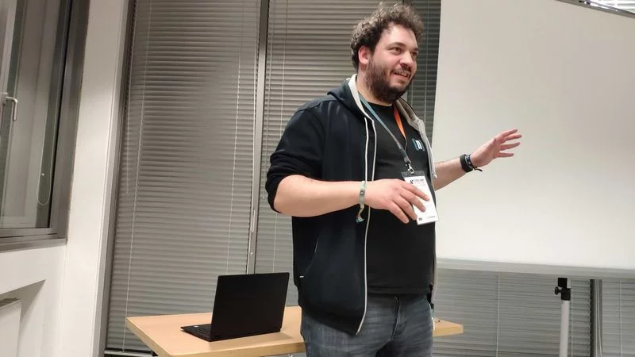

# Introduction – Thomas Schöne

> [Introduction](./0-introduction.md) | [CV](./1-cv.md) | [Portfolio](./3-portfolio.md) | [Contact](4-contact.md)

Thomas Schöne

## About me

I am a software developer with a passion for web development.
My main focus is on the development of web applications and the integration of web technologies into existing systems.
Currently most of it 

## Skills

### Software development

- Web development
- Web performance
- Web security
- TYPO3

### Consulting

- Web development
- CMS Workflows
- TYPO3

## Experience

## Main skills

- Web development
- TYPO3
- PHP/MySQL

## Buzzword bingo

JavaScript, MySQL, TYPO3, CMS, Solr, Docker, Docker Compose, Keycloak, MySQL, ESI, Varnish reverse proxy, Extbase, Fluid, REST APIs, Deployment, functional testing, unit testing, git, TYPO3 CMS, Nginx, Code Review, PHP, Semantic Web, RDF, CI/CD

> **⚠️ Please note** that this is not a complete list of all my skills.
> Take a look at my [CV](./1-cv.md) and [portfolio](./3-portfolio.md) for more information.
