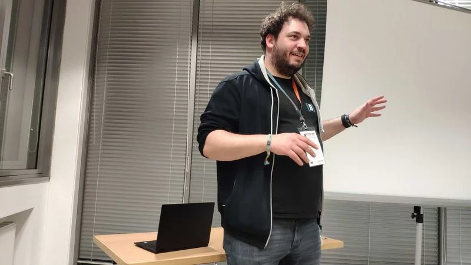

# Curriculum vitae – Thomas Schöne

Thomas Schöne

## Education

| period      | certificate                                          | institution                   |
|-------------|------------------------------------------------------|-------------------------------|
| 2011 - 2014 | Master of Science in Computer Science (Not finished) | Universität Leipzig           |
| 2007 - 2011 | Bachelor of Science in Computer Science              | Universität Leipzig           |
| 1998 - 2006 | Abitur                                               | Max Klinger Gymnasium Leipzig |

## Work Experience

| period       | position                  | company                                          |
|--------------|---------------------------|--------------------------------------------------|
| 2011 - 2014  | SHK/WHK                   | Institute of Computer Science                    |
| 2014 - 2021  | Software Developer        | [Netresearch DTT](https://www.netresearch.de/)   |
| 2021 - Today | Senior Software Developer | [Netresearch DTT](https://www.netresearch.de/)   |

## Speaker

| year | topic                                                                                             | conference                                                                   |
|------|---------------------------------------------------------------------------------------------------|------------------------------------------------------------------------------|
| 2018 | Semantic Web & TYPO3                                                                              | [TYPO3 Camp Mitteldeutschland](https://typo3camp-mitteldeutschland.de/)      |
| 2020 | nr_sync                                                                                           | [TYPO3 Camp Mitteldeutschland](https://typo3camp-mitteldeutschland.de/)      |
| 2022 | nr_textdb                                                                                         | [TYPO3 Camp Mitteldeutschland](https://typo3camp-mitteldeutschland.de/)      |
| 2022 | Editorial synchronization of media and TYPO3 data between different TYPO3 instances with nr_sync  | [TYPO3 Developer Days](https://t3dd22.typo3.com/speakers/thomas-schoene-285) |

## Skills

### Programming Languages

- PHP
- SQL
- Java
- JavaScript
- CSS
- SQL
- XML
- YAML

### Frameworks/CMS

- Symfony
- Extbase
- Fluid
- TYPO3
- WordPress

### Databases

- MySQL
- MariaDB
- Redis

### Tools

- Git
- GitHub
- Docker
- Docker Compose
- PhpStorm
- Solr
- Keycloak

### Operating Systems

- Windows
- Ubuntu

### Other

- Agile
- Scrum
- Kanban
- Jira
- Confluence

## Languages

- German (native)
- English (fluent)
- French (basic)
- Dutch (basic)

## Interests

- Programming
- Gaming
- Music (Guitar)
- Gardening
- Traveling

## References

- [Xing](https://www.xing.com/profile/Thomas_Schoene25)
- [Github](https://github.com/Thoemel42)
- [T3dd22](https://t3dd22.typo3.com/speakers/thomas-schoene-285)
- [nr_sync](https://github.com/netresearch/t3x-nr_sync)
- [cam_fight](https://github.com/netresearch/cam-fight-server)

## Contact

- [Email](mailto:twschoene@gmail.com)
- [Phone](tel:+491733544872)
